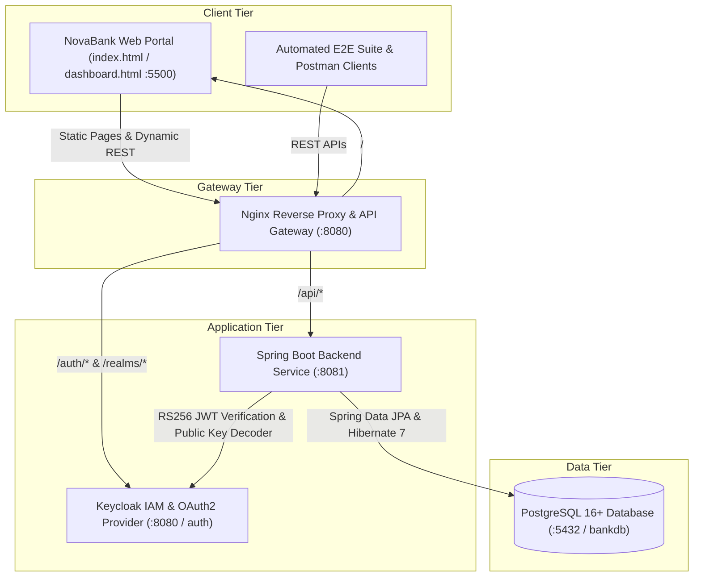
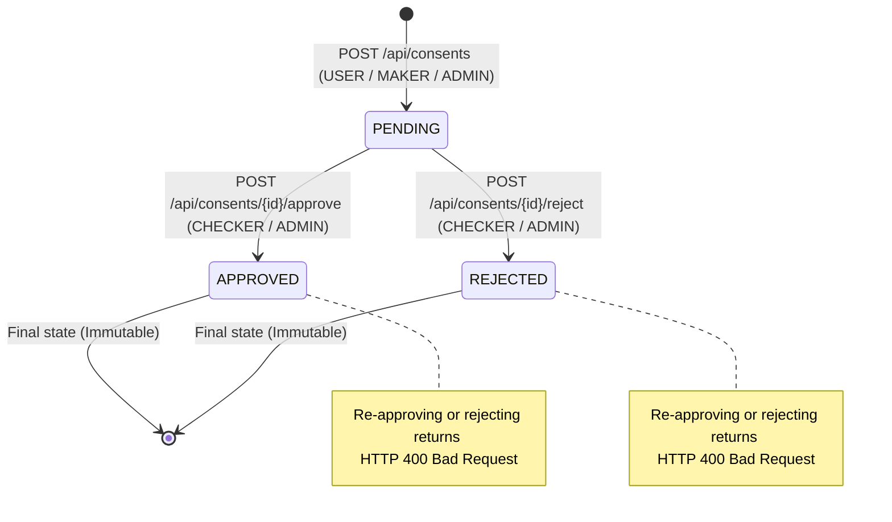

# NovaBank — Enterprise Mini Banking & Open Banking Consent Platform

[](https://spring.io/projects/spring-boot)
[](https://www.oracle.com/java/)
[](https://www.keycloak.org/)
[](https://www.postgresql.org/)
[]()

NovaBank is an enterprise-grade Digital Banking and Open Banking Consent Management Platform built with Java 21, Spring Boot, Spring Security (OAuth2 / OIDC RS256 JWT), PostgreSQL, Keycloak IAM, Nginx, and a clean, responsive glassmorphic frontend.

---

## Table of Contents
1. [System Architecture](#system-architecture)
2. [Role-Based Access Control (RBAC)](#role-based-access-control-rbac)
3. [Core Banking Modules](#core-banking-modules)
4. [Authentication & Registration Flow](#authentication--registration-flow)
5. [REST API Documentation](#rest-api-documentation)
6. [Open Banking Consent Lifecycle](#open-banking-consent-lifecycle)
7. [Local Standalone Setup (Without Docker)](#local-standalone-setup-without-docker)
8. [Docker Compose Deployment](#docker-compose-deployment)
9. [Automated Verification & Testing](#automated-verification--testing)
10. [Postman Collection](#postman-collection)
11. [Project Directory Layout](#project-directory-layout)
12. [Security & Error Handling Details](#security--error-handling-details)

---

## System Architecture



---

## Role-Based Access Control (RBAC)

The platform strictly enforces role segregation between institutional staff and retail customers:

| Role | Operational Scope & Permissions | Navigation Modules |
|---|---|---|
| **`ADMIN`** | **Full System Administrator**: Complete governance over customer accounts, bank accounts (creation, status update, deletion), transaction adjustments, payee records, consent approval/rejection, and system user directory. | Dashboard, Customers, Bank Accounts, Transfer Funds, Transactions, Beneficiaries, Consents, System Users, Profile |
| **`MAKER`** | **Operations Specialist**: Executes financial movements (Credit & Debit transfers) with real-time balance calculations, manages payees, submits consent requests, and reviews transaction logs. | Dashboard, Bank Accounts, Execute Transfer, Transactions, Beneficiaries, Consents, Profile |
| **`CHECKER`** | **Compliance & Verification Officer**: Dedicated authorization queue for reviewing, approving, and rejecting regulatory Open Banking consents, with full transaction auditing. | Dashboard, Consent Queue, Transactions, Accounts, Profile |
| **`USER`** | **Retail Banking Customer**: Self-service digital banking. Accesses personal accounts, initiates fund transfers, manages personal payees, requests Open Banking consents, and tracks personal balance. | Dashboard, My Accounts, Pay / Transfer, My Transactions, My Payees, My Consents, Profile |

---

## Core Banking Modules

1. **Customer Management (`/api/customers`)**:
   - Register new legal entities and individuals with name, email, phone, and address validation.
   - Searchable table with CSV export, profile editing, and deletion.
2. **Account Ledger (`/api/accounts`)**:
   - Multi-type account management: `SAVINGS`, `CURRENT`, and `SALARY`.
   - Real-time balance ledger with INR currency formatting (`formatCurrency`).
   - Account status state machine (`ACTIVE`, `SUSPENDED`, `CLOSED`).
3. **Transaction Engine (`/api/accounts/{id}/transactions`)**:
   - Atomic credit/debit operations executed under transactional database isolation.
   - Strict overdraft check (`INSUFFICIENT_FUNDS` guard against negative balances).
   - Unique alphanumeric audit references (e.g., `TXN-E25AF2F1`).
4. **Payee Beneficiary Directory (`/api/beneficiaries`)**:
   - External and internal payee registration with bank name, account number, and IFSC code.
   - Deletion safeguards restricted to `ADMIN` and `CHECKER`.
5. **Open Banking Consent Governance (`/api/consents`)**:
   - Regulatory consent creation for Account Information (AISP) and Payment Initiation (PISP).
   - Three-state lifecycle: `PENDING` -> `APPROVED` or `REJECTED`.
   - Immutable resolution: attempting to re-approve an approved consent returns `HTTP 400 Bad Request`.
   - Approval/rejection authorized for `CHECKER` and `ADMIN`.

---

## Authentication & Registration Flow

### 1. Professional Login Portal (`index.html`)
- Clean, institutional banking layout with NovaBank branding and 256-bit SSL badges.
- Username/email and password fields with password visibility toggle.
- "Remember me" username caching.
- Safe password recovery instructions modal.
- Direct link to customer registration.

### 2. Customer Registration (`register.html`)
- Self-service onboarding for new retail customers.
- Collects Full Name, Email, Phone, Address, Password, and Confirmation.
- Client-side validation ensures phone integrity (10+ digits) and password security (6+ characters).
- Submits to `POST /api/auth/register`, which:
  - Generates the customer record in PostgreSQL.
  - Registers the user credentials with role `USER`.
  - Enables immediate login.

---

## REST API Documentation

### Authentication & System Endpoints
| Method | Endpoint | Access | Description |
|---|---|---|---|
| `GET` | `/health` | Public | System liveness health check (`{"status":"UP"}`) |
| `GET` | `/api/info` | Public | Service metadata & build version |
| `POST` | `/api/auth/login` | Public | Authenticates credentials and returns signed RS256 Bearer JWT |
| `POST` | `/api/auth/register` | Public | Registers a new banking customer & user credentials |
| `GET` | `/api/users` | `ADMIN` | Retrieves system user directory and role assignments |

### Customer Endpoints
| Method | Endpoint | Access | Description |
|---|---|---|---|
| `GET` | `/api/customers` | Authenticated | Retrieve customer directory |
| `POST` | `/api/customers` | `ADMIN` | Register new customer profile |
| `GET` | `/api/customers/{id}` | Authenticated | Get customer profile details |
| `PUT` | `/api/customers/{id}` | `ADMIN` | Update customer details |
| `DELETE` | `/api/customers/{id}` | `ADMIN` | Remove customer record |

### Bank Account Endpoints
| Method | Endpoint | Access | Description |
|---|---|---|---|
| `GET` | `/api/accounts` | Authenticated | List bank accounts and balances |
| `POST` | `/api/accounts` | `ADMIN` | Open new bank account with initial deposit |
| `GET` | `/api/accounts/{id}` | Authenticated | Retrieve account by ID |
| `PUT` | `/api/accounts/{id}` | `ADMIN` | Update account status (`ACTIVE`, `SUSPENDED`, `CLOSED`) |
| `DELETE` | `/api/accounts/{id}` | `ADMIN` | Close and remove bank account |
| `GET` | `/api/accounts/customer/{customerId}` | Authenticated | Fetch accounts belonging to a specific customer |

### Transaction Endpoints
| Method | Endpoint | Access | Description |
|---|---|---|---|
| `POST` | `/api/accounts/{id}/transactions` | `ADMIN`, `MAKER` | Post CREDIT or DEBIT transaction with balance update |
| `GET` | `/api/accounts/{id}/transactions` | Authenticated | Retrieve account transaction history |
| `GET` | `/api/transactions` | Authenticated | Global transaction audit ledger |
| `GET` | `/api/transactions/{id}` | Authenticated | Transaction lookup by ID |

### Beneficiary Endpoints
| Method | Endpoint | Access | Description |
|---|---|---|---|
| `GET` | `/api/beneficiaries` | Authenticated | List registered beneficiaries |
| `POST` | `/api/beneficiaries` | Authenticated | Register new beneficiary payee |
| `GET` | `/api/beneficiaries/{id}` | Authenticated | Retrieve beneficiary by ID |
| `PUT` | `/api/beneficiaries/{id}` | Authenticated | Update beneficiary details |
| `DELETE` | `/api/beneficiaries/{id}` | `ADMIN`, `CHECKER` | Delete beneficiary payee |

### Open Banking Consent Endpoints
| Method | Endpoint | Access | Description |
|---|---|---|---|
| `POST` | `/api/consents` | Authenticated | Submit new consent request (sets status to `PENDING`) |
| `GET` | `/api/consents` | Authenticated | List all consent records |
| `GET` | `/api/consents/{id}` | Authenticated | Retrieve consent by ID |
| `POST` | `/api/consents/{id}/approve` | `ADMIN`, `CHECKER` | Approve pending consent |
| `POST` | `/api/consents/{id}/reject` | `ADMIN`, `CHECKER` | Reject pending consent |

---

## Open Banking Consent Lifecycle



---

## Local Standalone Setup (Without Docker)

### 1. Database Configuration
Ensure PostgreSQL is active on port 5432 and database `bankdb` is present:
```sql
CREATE DATABASE bankdb;
```
Configure [Bank backend/src/main/resources/application.properties](file:///c:/Users/Santhosh/Desktop/spring/banking/Bank%20backend/src/main/resources/application.properties):
```properties
spring.datasource.url=jdbc:postgresql://localhost:5432/bankdb
spring.datasource.username=postgres
spring.datasource.password=1234
```

### 2. Start Backend Service
```powershell
cd "c:\Users\Santhosh\Desktop\spring\banking\Bank backend"
.\mvnw.cmd spring-boot:run
```
Service starts on: [`http://localhost:8081`](http://localhost:8081)

### 3. Start Frontend Portal
```powershell
cd "c:\Users\Santhosh\Desktop\spring\banking\banking-frontend"
python -m http.server 5500
```
Open browser at: [`http://localhost:5500`](http://localhost:5500)

---

## Docker Compose Deployment

To build and run all 5 containerized services:
```powershell
cd "c:\Users\Santhosh\Desktop\spring\banking"
docker compose up --build -d
```

| Service | Container URL | Purpose |
|---|---|---|
| **NovaBank Frontend** | `http://localhost:8080/` | Web portal via Nginx Gateway |
| **Backend API Gateway** | `http://localhost:8080/api/` | Nginx reverse-proxied Spring Boot |
| **Keycloak IAM** | `http://localhost:8080/auth/` | Identity Provider & OpenID Connect |
| **Direct Backend Port** | `http://localhost:8081/` | Spring Boot Direct Access |
| **PostgreSQL** | `localhost:5432` | Relational Persistence |

---

## Automated Verification & Testing

### 1. Unit Tests (9/9 Passing)
Run JUnit 5 and Mockito test suites:
```powershell
cd "c:\Users\Santhosh\Desktop\spring\banking\Bank backend"
.\mvnw.cmd test
```

### 2. Automated E2E Regression Suite (17/17 Passing)
Execute the complete end-to-end regression suite covering RBAC, token extraction, customer CRUD, balance arithmetic, and consent state guards:
```powershell
cd "c:\Users\Santhosh\Desktop\spring\banking"
powershell -ExecutionPolicy Bypass -File .\test_all.ps1
```

### 3. User Registration Verification
```powershell
powershell -ExecutionPolicy Bypass -File .\test_register.ps1
```

---

## Postman Collection

Import [`postman/banking-api.json`](file:///c:/Users/Santhosh/Desktop/spring/banking/postman/banking-api.json) into Postman:
- 7 structured test suites with pre-configured requests.
- Automatic extraction and injection of Bearer tokens (`adminToken`, `makerToken`, `checkerToken`).
- Negative security test cases for `401 Unauthorized` and `403 Forbidden`.

---

## Security & Error Handling Details

1. **User-Friendly Error Handling**:
   - `401 Unauthorized`: `"Your session has expired. Please login again."` (auto-redirects to login).
   - `403 Forbidden`: `"You do not have permission to perform this action."`
   - Zero raw Java exceptions, stack traces, or technical database leaks are presented to end users.
2. **Object-Level & Role Scoping**:
   - Normal users are scoped to their own customer accounts, transactions, payees, and consents.
   - Admin access is enforced at the controller route level via Spring Security matchers.
